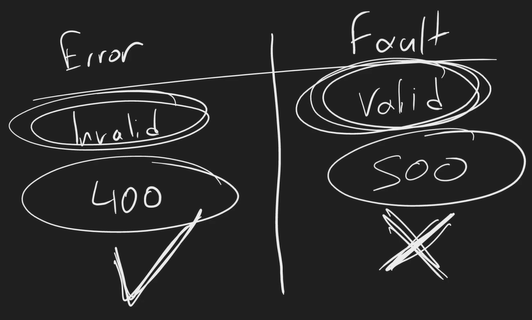

# Introduction to RESTful APIs

## The 6 constraints of REST

### Uniform Interface

- Identification of resources
- Manipulation of resources through representations
- Self-descriptive messages
- Hypermedia as the engine of application state (HATEOAS)

> [!WARNING]
> Warn: In modern RESTful APIs, HATEOAS is highly debatable and often omitted.

### Stateless

> [!IMPORTANT]
> The stateless constraint is the one most important constraint of REST. It is a huge part of what makes REST so popular.

It ultimately mandates that the server does not store any state about the client session on the server side. The client must include all the information needed to process the request in the request itself, whether it is a query parameter, body, headers, or URI. The server cannot rely on the existing state on the server.

Example of stateless constraint in real-life distributed systems with LB (Load Balancer):


### Cacheable

The server should implicitly or explicitly let the client know if it can cache the response or not and for how long it can cache it.
However, it's up to the client to decide whether to cache the response or not.

### Client-Server

Client and Server should agree on the contract (Client or server can evolve independently but should agree upon the contract)


### Layered System

The client can't know if it's directly connected to the end server or some load balancer


### Code on Demand (optional)

> [!NOTE]
> Rarely, or never used based on the type of API.

The server can actually send code, literal code, the idea was JavaScript, at the client to run.

## Resource naming and routing

Resource is the item that the client wants to interact with. It can be a user, a product, a blog post, etc.

Routing basically means the endpoint to get into those resources

If you wanna access movies

`GET /movies`

> [!IMPORTANT]
> Not movie, should be /movies (plural)

If you wanna access specific movie by id

`GET /movies/1`

Get the ratings for specific movie

`GET /movies/1/ratings`

If you wanna rate a movie, you can't do

`POST /movies/1/rate`

rather you should do

`POST /movies/1/ratings`

> [!TIP]
> POST/PATCH based on create or update operation behind the scene

If you wanna delete the ratings

`DELETE /movies/1/ratings`

If you wanna delete a rating

`DELETE /movies/1/ratings/1`

## HTTP Verbs are meaningful

When we're gonna specify the intent of what we're gonna do with the resource, we're gonna use HTTP verbs. not change the name of resource itself.

Let's say we have a resource called movies

POST - Create (Create a new resource) - use when you want to create a new resource
GET - Retrieve (Get a resource or list of resources) - use when you want to fetch one or multiple resources
PUT - Update (Update a resource) - use when you want to replace the entire resource
PATCH - Partial update (Update a resource) - use when you want to update a part of the resource
DELETE - Delete (Delete a resource) - use when you want to delete a resource

> [!NOTE]
> GET is also known as a safe method, meaning it does not change the state of the resource.

## Using response codes to indicate status

<https://developer.mozilla.org/en-US/docs/Web/HTTP/Status>

These are HTTP verb response types as per scenario

Single resource: /items/1
Multiple resources: /items

POST

- Single resource creation: N/A
- Multiple resource creation: 201 Created (Location Header should be provided to get the location of the newly created resource), 202 Accepted (If the request is accepted but not yet processed, likely to be processed asynchronously)

GET

- Single resource retrieval: 200 OK, 404 Not Found
- Multiple resource retrieval: 200 OK (All items or empty collection)

PUT

- Single resource update: 200 OK, 204 No Content, 404 Not Found
- Multiple resource update: 405 Method Not Allowed

DELETE

- Single resource deletion: 200 OK, 404 Not Found
- Multiple resource deletion: 405 Method Not Allowed

## Flexible response body options

By default, REST APIs should return JSON as the response body.

```json
{
  "data": {
    "id": 1,
    "name": "John Doe",
    "email": "<john.doe@example.com>"
  }
}
```

Accept: application/xml (if the client wants XML)

```xml
<user>
  <id>1</id>
  <name>John Doe</name>
  <email>john.doe@example.com</email>
</user>
```

## Understanding Idempotency

No wonder how many times you proceed the specific request, the result will always be same on the server.

- POST - Not Idempotent (Because resource already created on the system i.e. validation error)
- GET - Idempotent
- PUT -Idempotent
- DELETE - Idempotent
- HEAD - Idempotent
- OPTIONS - Idempotent
- TRACE - Idempotent

## Using hypermedia for connectedness

HATEOAS - Hypermedia As The Engine Of Application State

HATEOAS allows clients to interact with RESTful APIs through hyperlinks provided in the responses, enabling dynamic navigation of the application via standard HTTP methods.

> [!WARNING]
> HATEOAS is highly debatable and often omitted in modern RESTful APIs.

Example HATEOAS response:

```json
{
  "account": {
    "account_number": "12345",
    "balance": {
      "currency": "usd",
      "value": 100.2
    },
    "links": [
      {
        "rel": "deposit",
        "href": "/account/12345/deposits"
      },
      {
        "rel": "withdraw",
        "href": "/account/12345/withdrawals"
      }
    ]
  }
}
```

## The different types of errors

RESET APIs have two categories of things going wrong:

- Error
- Fault

| Category | Request | ResponseCode | Description                                                                                                                         |
| -------- | ------- | ------------ | ----------------------------------------------------------------------------------------------------------------------------------- |
| Error    | Invalid | 400          | The api is working fine, client did something stupid                                                                                |
| Fault    | Valid   | 500          | The request was actually valid but something on the server happened so server couldn't process it eg. database down, DDoS, bug, etc |


