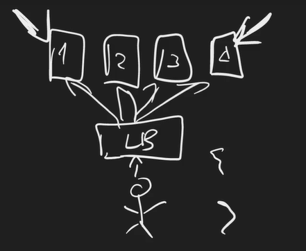
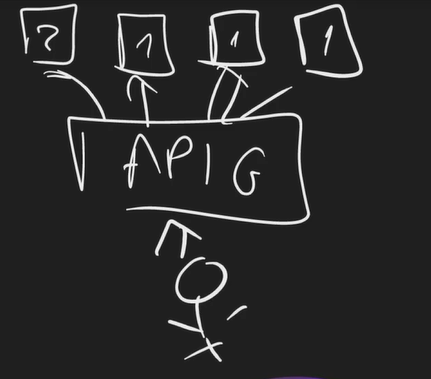

# Introduction to RESTful APIs

## The 6 constraints of REST

### Uniform Interface

- Identification of resources
- Manipulation of resources through representations
- Self-descriptive messages
- Hypermedia as the engine of application state (HATEOAS)

> [!WARNING]
> Warn: In modern RESTful APIs, HATEOAS is highly debatable and often omitted.

### Stateless

> [!IMPORTANT]
> The stateless constraint is the one most important constraint of REST. It is a huge part of what makes REST so popular.

It ultimately mandates that the server does not store any state about the client session on the server side. The client must include all the information needed to process the request in the request itself, whether it is a query parameter, body, headers, or URI. The server cannot rely on the existing state on the server.

Example of stateless constraint in real-life distributed systems with LB (Load Balancer):

### Cacheable

The server should implicitly or explicitly let the client know if it can cache the response or not and for how long it can cache it.
However, it's up to the client to decide whether to cache the response or not.

### Client-Server

Client and Server should agree on the contract (Client or server can evolve independently but should agree upon the contract)

### Layered System

The client can't know if it's directly connected to the end server or some load balancer

### Code on Demand (optional)

> [!NOTE]
> Rarely, or never used based on the type of API.

The server can actually send code, literal code, the idea was JavaScript, at the client to run.

## Resource naming and routing

Resource is the item that the client wants to interact with. It can be a user, a product, a blog post, etc.

Routing basically means the endpoint to get into those resources

If you wanna access movies

`GET /movies`

> [!IMPORTANT]
> Not movie, should be /movies (plural)

If you wanna access specific movie by id

`GET /movies/1`

Get the ratings for specific movie

`GET /movies/1/ratings`

If you wanna rate a movie, you can't do

`POST /movies/1/rate`

rather you should do

`POST /movies/1/ratings`

> [!TIP]
> POST/PATCH based on create or update operation behind the scene

If you wanna delete the ratings

`DELETE /movies/1/ratings`

If you wanna delete a rating

`DELETE /movies/1/ratings/1`
