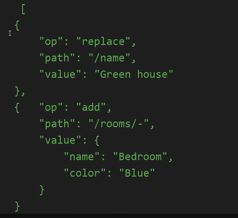

# Getting started with REST API

This is a practical phase, refer to project [ResetApiCourse](./ResetApiCourse.sln) for more details.

**Topics covered:**

- The system we will build an API for
- Creating the projects
- Defining the movie API contracts
- Creating a temporary database
- Creating the movies controller
- Implementing movie creation
- Introducing mapping
- Keeping track of the endpoints
- Implementing movie retrieval
- Perfecting the movie creation endpoint
- Implementing movie update
- Implementing movie deletion

- Why partial updates are not used
  Patch (partial updates) has really fallen out of favor in the API world. The reason is that it is hard to implement correctly and consistently. It is much easier to implement a PUT endpoint that takes the full object and updates it. This is why we are not implementing a PATCH endpoint.
  Patch request looks something like this:
  

> [!NOTE]
> Project i.e. ./ResetApiCourse.sln is in final state
